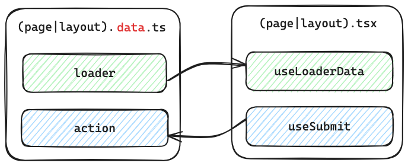

# 路由数据

有些数据可能会明显影响到我们的路由组件展示和用户体验，这种跟路由密切关联的数据就叫**路由数据**。例如：
- 用户中心页面里的头像、昵称等就是路由数据
- 商品详情页面里的商品头图、名称、价格等也应该是路由数据

在一般的 React 开发中，我们会在组件的 `useEffect` 中发起数据请求，也就是需要等待组件代码加载->组件渲染后才能发起请求。
这对于路由数据来说时机太晚了，尤其是当遇到多层嵌套路由时，如果每层路由都有自己的数据请求，可能会导致**瀑布流加载**。

假如我们有这样的嵌套路由结构：


当进入 `/dashboard/settings` 时，传统 React 应用中会存在这样的瀑布流加载：

`load App script` -> `render App` -> `fetch /api/app` -> `load Dashboard script` -> `render Dashboard` 
-> `fetch /api/dashboard` -> `load Settings script` -> `render Settings` -> `fetch /api/settings`

经过这样的加载后页面才最终可用，用户体验是比较差的。因此，Servite 借助 React Router v6 的 loader 和 action，
实现了路由数据的并行加载，得到更好的性能表现和用户体验。



## 数据加载

Servite 约定了加 `.data` 后缀的文件为对应路由的**数据文件**，举个例子，
- 如果布局路由文件是 `src/pages/layout.tsx`，那么它对应的数据文件是 `src/pages/layout.data.ts`
- 如果页面路由文件是 `src/pages/about/page.tsx`，那么对应的数据文件是 `src/pages/about/page.data.ts`

我们可以在数据文件中导出一个 `loader` 函数用于数据获取：

```ts
// page.data.ts
export async function loader() {
  return fetch('/api/some-data');
}
```

## 数据更新
