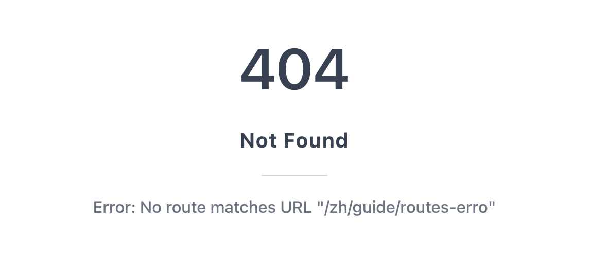
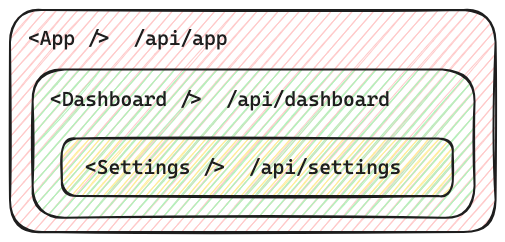

# 路由错误展示

当在 `loader`，`action` 或者组件 render 中抛出错误时，Servite 会捕获这些错误，然后展示在页面上：



如果想自定义这个错误展示，可以在路由文件中导出 `ErrorBoundary` 组件：

```tsx
// src/pages/page.tsx
export function ErrorBoundary() {
  return <div>🫨 啊噢，出错啦！</div>
}
```

## 错误的冒泡

在多层嵌套的路由结构中，当底层的页面组件抛出错误时，错误会逐层“冒泡”，最终在最近的 `ErrorBoundary` 里被捕获并展示。

例如这样的路由结构：



当 `<Settings />` 渲染发生错误时，会先寻找 `/dashboard/settings/page.tsx` 里导出的 `ErrorBoundary` 组件，
- 如果找到了，则会使用该组件来渲染错误信息，至于 `<App />` 和 `<Dashboard />` 则会照常渲染。
- 如果没找到，则错误会继续往上冒泡，直到被 Servite 的顶层默认 `ErrorBoundary` 所捕获。
